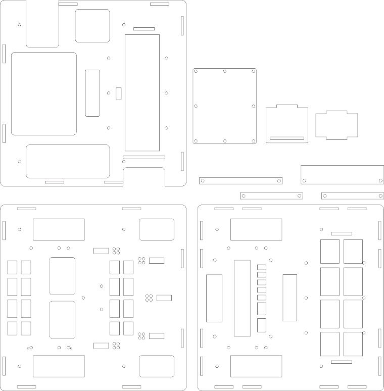

  
  

# Overview

`提示：如果图片模糊、按钮等还没有显示，可能是网速较慢`

> Entrance for FIRAstudents 我是一名学生
> 

> LastUpdate 最近一次更新内容

* 版本号201907121108

续写了死亡教程  [->点击进入教程](https://github.com/visualDust/FIRAHandling/blob/master/Documents/LibDoc.markdown "点击进入教程")  
[Grobot库](https://github.com/visualDust/FIRAHandling/blob/master/Libiaries/Grobot.h "Grobot.h")增加了舵机驱动方法  
更新了图纸  
加入了README.markdown  
作者买了新的咖啡

> 目前的硬件图纸
> 
  

> 过往更新

* 无过往更新

